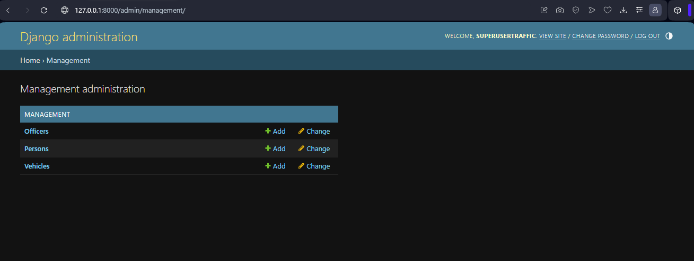
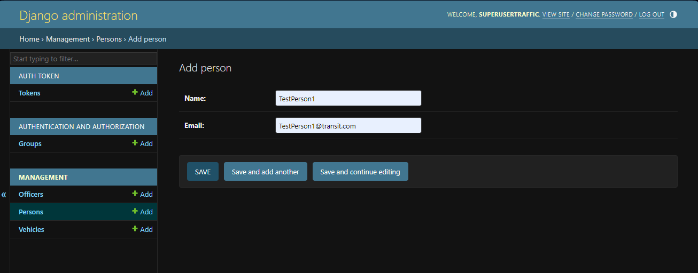
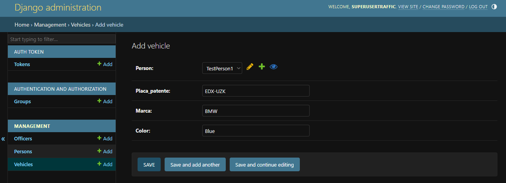
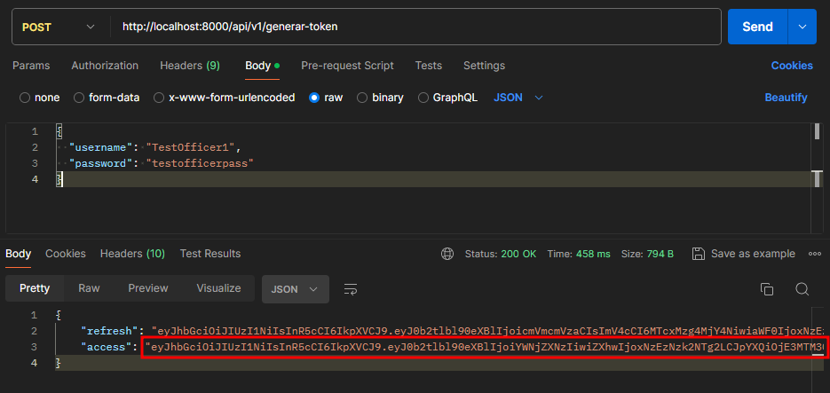
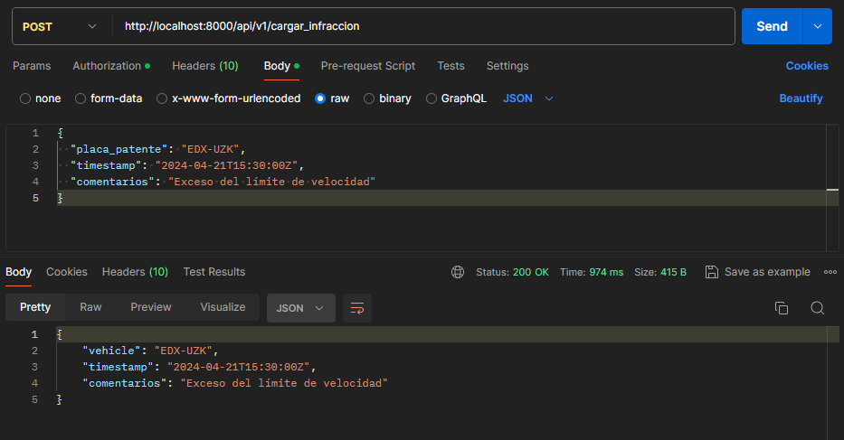
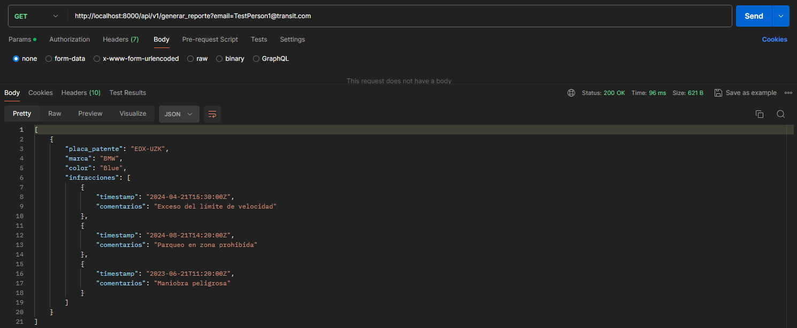

# challenger-dev-python

# Traffic Offenses Registration Project

This project implements a traffic offenses registration system in Python using the Django framework. The system consists of an administrative interface for managing persons, vehicles, and officers, as well as an API that allows an application used by police officers to upload offenses for vehicles and generate reports.

## Installation

1. Clone this repository:

    ```
    git clone https://github.com/felixsuarez0727/challenger-dev-python.git
    ```

2. Create and activate a virtual environment:

    ```
    python -m venv challenger-dev-venv
    source challenger-dev-venv/bin/activate
    ```

    On Windows use

    ```
    challenger-dev-venv\Scripts\activate
    ```

3. Install the project dependencies:

    ```
    pip install -r requirements.txt
    ```

## Running the Project

1. Activate your virtual environment if you haven't already:

    ```
    source challenger-dev-venv/bin/activate
    ```
    
    On Windows use

    ```
    challenger-dev-venv\Scripts\activate
    ```

2. Navigate to the project directory:

    ```
    cd traffic-offences
    ```

3. Prepare database:

    ```
    python manage.py makemigrations
    python manage.py migrate
    ```

4. Create  a superuser (Will be needed for admin access):

    ```
    python manage.py createsuperuser
    ```

    With credentials

    ```
    **Username:** superusertraffic
    **Password:** superuserpass
    ```

5. Run the application:

    ```
    python manage.py runserver
    ```

6. Access the administrative interface in your web browser:

    ```
    http://localhost:8000/admin
    ```

7. Enter the following credentials to access the administrative interface:

    - **Username:** superusertraffic
    - **Password:** superuserpass



After logging in, you can start registering people, vehicles and officers.





## API Usage

### Generate Tokens
To generate API access tokens, you must send a JSON with `username` and `password` for an officer account. You can send a POST request to the URL:`http://localhost:8000/api/v1/generar-token` or use the following `curl` command to get the token:

    ```
    curl -X POST http://localhost:8000/api/v1/generar-token -H "Content-Type: application/json" -d "{\"username\":\"TestUser\", \"password\":\"testuserpass\"}"
    ```

Your access token will be the value of the 'access' attribute.



Be sure to copy it in full

### Upload Offense
This endpoint requires authorization using a Bearer token. To upload an offense, attach the token in the Authorization header of the POST request:
You can access the through endpoint

    ```
    http://localhost:8000/api/v1/cargar_infraccion
    ```



### Generate Report
This endpoint does not require authorization and receives an email parameter to generate a report for the specified person:
You can access the through endpoint

    ```
    http://localhost:8000/api/v1/generar_reporte?email=example@example.com
    ```


